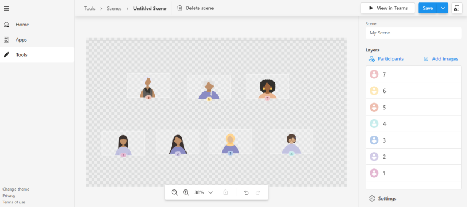
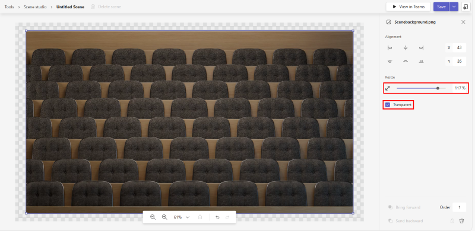
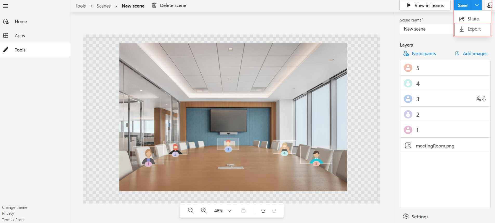
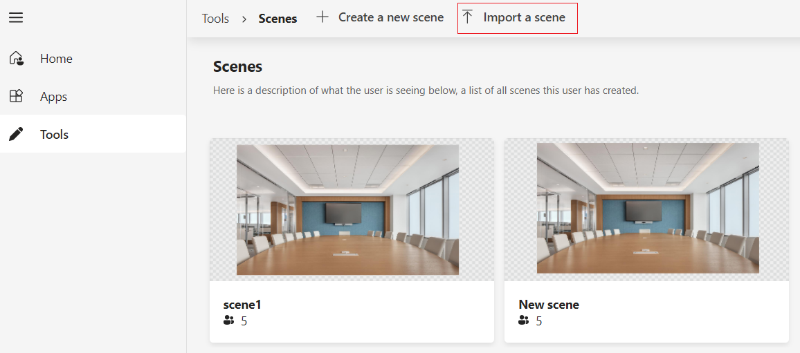

# Custom Together Mode scenes in Teams

Custom Together Mode scenes in Microsoft Teams provide an immersive and engaging meeting environment with the following actions:

* Bring people together and encourage them to turn on their video. 
* Combine participants digitally into a single virtual scene. 
* Place the participants' video streams in pre-determined seats designed and fixed by the scene creator.

> [!VIDEO https://www.youtube-nocookie.com/embed/MGsNmYKgeTA]

In custom Together Mode scenes, the scene is an artifact. The scene is created by the scene developer using the Microsoft Scene studio. In a conceived scene setting, participants have seats with video streams. The videos are rendered in those seats. Scene only apps are recommended as the experience for such apps is clear.

The following process gives an overview to create a scene only app:

:::image type="content" source="../assets/images/apps-in-meetings/create-together-mode-scene-flow.png" alt-text="Create scene only app" border="false":::

A scene only app is still an app in Microsoft Teams. The Scene studio handles the app package creation in the background. Multiple scenes in a single app package appear as a flat list to the users.

## Prerequisites

You must have a basic understanding of the following to use custom Together Mode scenes:

* Define scene and seats in a scene.
* Have a Microsoft Developer account and be familiar with the Microsoft Teams [Developer Portal](../concepts/build-and-test/teams-developer-portal.md) and App Studio.
* Understand the [concept of app sideloading](../concepts/deploy-and-publish/apps-upload.md).
* Ensure that the Administrator has granted permission to [**Upload a custom app**](../concepts/deploy-and-publish/apps-upload.md) and select all filters as part of App Setup and Meeting policies respectively.

## Best practices

Consider the following practices for a scene building experience:

* Ensure that all images are in PNG format.
* Ensure that the final package with all the images put together must not exceed 1920x1080 resolution. The resolution is an even number. This resolution is a requirement for scenes to be shown successfully.
* Ensure that the maximum scene size is 10 MB.
* Ensure that the maximum size of each image is 5 MB. A scene is a collection of multiple images. The limit is for each individual image.
* Ensure to select **Transparent** as required. This checkbox is available on the right panel when an image is selected. The overlapping images must be marked as **Transparent** to indicate that they're overlapping images in the scene.

## Build a scene using the Scene studio

Microsoft has a Scene studio that allows you to build scenes. It's available on [Scenes Editor - Teams Developer Portal](https://dev.teams.microsoft.com/scenes). This document refers to Scene studio in the Microsoft Teams Developer Portal. The interface and functionalities are all the same in App Studio Scene Designer.

A scene in the context of the Scene studio is an artifact that contains the following elements:

* Seats reserved for meeting organizer and meeting presenters. The presenter doesn't refer to the user who is actively sharing. It refers to the [meeting role](https://support.microsoft.com/en-us/office/roles-in-a-teams-meeting-c16fa7d0-1666-4dde-8686-0a0bfe16e019).

* Seat and image for each participant with an adjustable width and height. Only PNG format is supported for the image.

* XYZ coordinates of all the seats and images.

* Collection of images that are camouflaged as one image.

The following image shows each seat represented as an avatar for building the scenes:



**To build a scene using the Scene studio**

1. Go to [Scenes Editor - Teams Developer Portal](https://dev.teams.microsoft.com/scenes).

    Alternately, to open Scene studio you can go to the home page of [Teams Developer Portal](https://dev.teams.microsoft.com/home):
    * Select **Create custom scenes for meetings**.
    * Select **Tools** from the left-hand section, and select **Scene studio** from the **Tools** section.

1. In **Scenes Editor**, select **Create a new scene**.

1. In **Scene Name**, enter a name for the scene.

    * You can select **Close** to toggle between closing or reopening the right pane.
    * You can zoom in or zoom out of the scene using the zoom bar for a better view of the scene.

1. Select **Add images** to add the image into the environment:

    

    >[!NOTE]
    > * You can download the [SampleScene.zip](https://github.com/MicrosoftDocs/msteams-docs/tree/master/msteams-platform/apps-in-teams-meetings/SampleScene.zip) and [SampleApp.zip](https://github.com/MicrosoftDocs/msteams-docs/tree/master/msteams-platform/apps-in-teams-meetings/SampleApp.zip) files with the images.

1. Select the image that you've added.

1. From the right pane, select an alignment for the image or use **Resize** to adjust the image size:

    

1. Select an area outside of the image.

1. In the upper-right corner, select **Participants** under **Layers**.

1. Select the number of participants for the scene from the **Number of participants** box, and select **Add**. After the scene is shipped, the avatar placements are replaced with actual participant's video streams. You can drag the images of the participants around the scene and place them in the required position. You can resize them using the resize arrow.

1. Select any participant image, and select **Assign Spot** to assign the spot to the participant.

1. Select **Meeting Organizer** or **Presenter** role for the participant. In a meeting, one participant must be assigned the role of a meeting organizer:

    

1. Select **Save** and select **View in Teams** to quickly test your scene in Microsoft Teams.

    * Selecting **View in Teams** automatically creates a Microsoft Teams app that can be viewed in the **Apps** page in the Teams Developer Portal.
    * Selecting **View in Teams** automatically creates an app package that is appmanifest.json behind the scene. You can go to  **Apps** from the menu and access the automatically created app package.
    * To delete a scene you created, select **Delete scene** on the top bar.

1. In **View in Teams**, select **Preview in Teams**.
1. In the dialog box that appears, select **Add**.

    The scene is tested or accessed by creating a test meeting and launching custom Together Mode scenes. For more information, see [activate custom Together Mode scenes](#activate-custom-together-mode-scenes):

    

    The scene can then be viewed in the custom Together Mode scenes gallery.

Optionally, you can select **Share** from the **Save** drop-down menu. You can create a shareable link to distribute your scenes for others to use. The user can open the link to install the scene and start using it.

After preview, the scene is shipped as an app to Teams by following the steps for app submission. This step requires the app package. The app package is different from the scene package, for the scene that was designed. The app package created automatically is found in the **Apps** section in the Teams Developer Center.

Optionally, the scene package is retrieved by selecting **Export** from the **Save** drop-down menu. A **.zip** file, that is the scene package, is downloaded. Scene package includes a scene.json and the PNG assets used to build a scene. The scene package is reviewed for incorporating other changes:



A complex scene that uses the Z-axis is demonstrated in the step-by-step getting started sample.

## Sample scene.json

Scene.json along with the images indicate the exact position of the seats. A scene consists of bitmap images, sprites, and rectangles to put participant videos in. These sprites and participant boxes are defined in a world coordinate system. The X-axis points to the right and the Y-axis points downwards.

Custom Together Mode scenes support zooming in on the current participants. This feature is helpful for small meetings in a large scene. A sprite is a static bitmap image positioned in the world. The Z value of the sprite determines the position of the sprite. Rendering starts with the sprite with lowest Z value, so higher Z value means it's closer to the camera. Each participant has its own video feed, which is segmented so only the foreground is rendered.

The following code is the scene.json sample:

```json
{
   "protocolVersion": "1.0",
   "id": "A",
   "autoZoom": true,
   "mirrorParticipants ": true,
   "extent":{
      "left":0.0,
      "top":0.0,
      "width":16.0,
      "height":9.0
   },
   "sprites":[
      {
         "filename":"background.png",
         "cx":8.0,
         "cy":4.5,
         "width":16.0,
         "height":9.0,
         "zOrder":0.0,
   "isAlpha":false
      },
      {
         "filename":"table.png",
         "cx":8.0,
         "cy":7.0,
         "width":12.0,
         "height":4.0,
         "zOrder":3.0,
   "isAlpha":true
      },
      {
         "filename":"row0.png",
         "cx":12.0,
         "cy":15.0,
         "width":8.0,
         "height":4.0,
         "zOrder":2.0,
   "isAlpha":true
      }

   ],
   "participants":[
      {
         "cx":5.0,
         "cy":4.0,
         "width":4.0,
         "height":2.25,
         "zOrder":1.0,
         "seatingOrder":0
      },
      {
         "cx":11.0,
         "cy":4.0,
         "width":4.0,
         "height":2.25,
         "zOrder":1.0,
         "seatingOrder":1
      }
   ]
}
```

Each scene has a unique ID and name. The scene JSON also contains information on all the assets used for the scene. Each asset contains a filename, width, height, and position on the X and Y-axis. Similarly, each seat contains a seat ID, width, height, and position on the X and Y-axis. The seating order is generated automatically and is altered as per preference. The seating order number corresponds to the order of people joining the call.

The `zOrder` represents the order of placing images and seats along the Z-axis. It gives a sense of depth or partition if necessary. See the step-by-step getting started sample. The sample uses the `zOrder`.

Now that you've gone through the sample scene.json, you can activate the custom Together Mode scenes to engage in scenes.

## Activate custom Together Mode scenes

Get more information of how a user engages with scenes in custom Together Mode scenes.

**To select scenes and activate custom Together Mode scenes**

1. Create a new test meeting.

    >[!NOTE]
    > On selecting **Preview** in the Scene studio, the scene is installed as an app in Microsoft Teams. This is the model for a developer to test and try out scenes from the Scene studio. After a scene is shipped as an app, users see these scenes in the scene gallery.

1. From the **Gallery** drop-down in the upper-left corner, select **Together Mode**. The **Picker** dialog box appears and the scene that is added is available.

1. Select **Change scene** to change the default scene.

1. From the **Scene Gallery**, select the scene you want to use for your meeting.

    Optionally, the meeting organizer and presenter can **Change scene for all participants** in the meeting.

    >[!NOTE]
    > At any point in time, only one scene is used homogeneously for the meeting. If a presenter or organizer changes a scene, it  changes for all. Switching in or out of custom Together Mode scenes is up to individual participants, but while in custom Together Mode scenes, all participants have the same scene.

1. Select **Apply**. Teams installs the app for the user and applies the scene.

## Open a custom Together Mode scenes Scene Package

You can share the Scene Package that is a .zip file retrieved from the Scene studio to other creators to further enhance the scene. The **Import a Scene** functionality helps unwrap a scene package to let the creator continue building the scene.



## See also

[Apps for Teams meetings](teams-apps-in-meetings.md)
