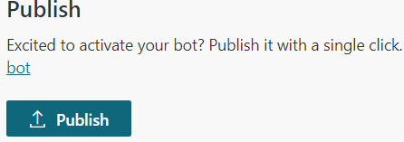

# Add Power Virtual Agents chatbot

Power Virtual Agents is a no-code, guided graphical interface solution that empowers every member of your team to create rich, conversational chatbots that easily integrate with the Teams platform. All content authored in Power Virtual Agents renders naturally in Teams. Power Virtual Agents bots engage with users in the Teams native chat canvas. The IT administrators, business analysts, domain specialists, and skilled app developers can design, develop, and publish intelligent virtual agents for Teams without having to setup a development environment. They can create a web service, or directly register with the Bot Framework.

This document guides you on how to make your chatbot available in Teams through the Power Virtual Agents portal and add your bot to Teams using Developer Portal.

Power Virtual Agents lets you create powerful chatbots that can answer questions posed by your customers, other employees, or visitors to your website or service.

These bots can be created easily without the need for data scientists or developers.

> [!NOTE]
>
> * By adding your chatbot to Microsoft Teams, some of the data, such as bot content and user chat content, is shared with Teams. It means that your data flows outside of your [organization’s compliance and geographic or regional boundaries](/power-virtual-agents/data-location). <br/>
> * You must not use Microsoft Power Platform to create apps that are to be published to the Microsoft Teams Store. Microsoft Power Platform apps can be published to an organization’s app store only.

## Make your chatbot available in Teams through the Power Virtual Agents portal

To make your chatbot available in Teams through the Power Virtual Agents portal, you must perform the following process steps:

To make the chatbot available in Teams:

1. **Publish the latest bot content**  
After creating a chatbot in the Power Virtual Agents portal, you must publish your bot before Teams users can interact with it. For more information, see [Publish the latest bot content](/power-virtual-agents/publication-fundamentals-publish-channels#publish-the-latest-bot-content).

   

1. **Configure the Teams channel**  
After publishing your bot, add the Teams channel to make the bot available to Teams users.

   

1. **Generate an App ID for your chatbot**  
After adding the Teams channel to your chatbot, an **App ID** is generated in the dialog box. The App ID is a unique Microsoft generated identifier for your bot. Save the App ID to create an app package for Teams.

## Add your bot to Teams using Developer Portal

If [uploading custom apps is enabled](/microsoftteams/admin-settings) in your Teams instance, you can use Teams Developer Portal to directly upload your chatbot and start using it immediately. To share your chatbot, you can request your admin to make your bot available in the tenant app catalog or you can send your app package to others and ask them to upload it independently.

1. **Install Developer Portal in Teams**

   Install Developer Portal from the Teams Store that simplifies the process of bot creation and registration in Teams:

   1. Select the Teams Store icon from Teams instance, and search for **Developer Portal**.

      :::image type="content" source="../../assets/images/tdp/dev-portal-app.png" alt-text="Screenshot shows how to add Developer Portal apps in Teams client." lightbox="../../assets/images/tdp/add-dev-portal.png":::

   1. Select the **Developer Portal** and select **Add** in the pop-up dialog box.

      :::image type="content" source="../../assets/images/tdp/home-page-dev-portal.png" alt-text="Screenshot shows home page of the Developer Portal apps in Teams client.":::

1. **Create the app manifest (previously called Teams app manifest) in Developer Portal**

   1. Bots in Teams are defined by an app manifest JSON file that provides the basic information about your bot and its capabilities. In **Developer Portal**, select **Apps**, and select **New app**.

      :::image type="content" source="../../assets/images/tdp/create-new-app.png" alt-text="Screenshot shows how to create app manifest in Developer Portal.":::

   1. Enter your app name and select **Save**.

1. **Set up your bot**

   To set up your bot, perform the following steps:
     1. Go to **App features** > **Bots**.
     1. Select **Enter a bot ID** and then enter your bot ID.
     1. Select required scopes and then select **Save**.

1. **Add valid domains for your bot**  

   This step is only applicable, if you want your user to sign in to the bot:
     1. Go to **Domains** under **Configure** section.
     1. Select **Create your first domain** and enter a valid domain.
     1. Select **Add**.

    ```bash
       token.botframework.com
    ```

1. **Test and distribute your bot**  

   Select **Preview in Teams** to add your bot directly to your Teams instance. Alternately, you can download the completed app package to share with Teams users or provide it to your admin to make your bot available in the tenant app catalog.

1. **Start a chat**

   The set up process for adding your Power Virtual Agents chat bot to Teams is complete. You can now start a conversation with your bot in a personal chat.

## See also

* [Integrate web apps](../../samples/integrate-web-apps-overview.md)
* [Developer Portal for Teams](../../concepts/build-and-test/teams-developer-portal.md)
* [Power Virtual Agents](/power-virtual-agents/fundamentals-what-is-power-virtual-agents)  
* [Create a chatbot for Teams with Microsoft Power Virtual Agents](../bot-features.md#bots-with-power-virtual-agents)
* [Power Virtual Agents portal](https://powervirtualagents.microsoft.com)
* [Publish your Power Virtual Agents bot](/power-virtual-agents/publication-fundamentals-publish-channels)
* [Security and compliance in Microsoft Teams](/microsoftteams/security-compliance-overview)
* [Human resources Power Virtual Agents bot](/power-virtual-agents/teams/fundamentals-get-started-teams)
* [Add a chatbot to Microsoft Teams from within the Teams app](/power-virtual-agents/teams/publication-add-bot-to-microsoft-teams-teams)
