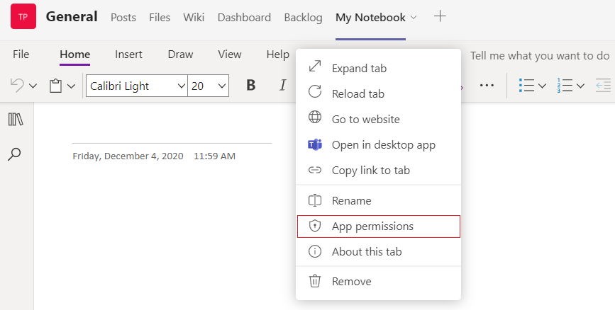

# Device permissions for the browser

> [!NOTE]
> The change to how device permissions are handled in the browser is currently available in [public developer preview](../../resources/dev-preview/developer-preview-intro.md) only. 
> This change will be generally available (GA) by February 01, 2022.

Applications that require device permissions - such as camera or microphone access - now require users to manually grant consent at a per app level in the web browser. Previously, the browser handled how these permissions were granted, but now these permissions will be handled in Microsoft Teams. This has implications on how you design your application if they require these permissions in the browser.

## Change in behavior
If your application has declared that it needs device permissions in your [application manifest](native-device-permissions.md), then users will be shown an "app permissions" option where they can enable an app’s device permissions. The "app permissions" option can be found in personal apps, task module dialogs, and tabs in chats, channels or meetings.

### Personal apps and task module dialogs
The "app permissions" setting can be found in the top-right.

### Chat, channel or meeting tabs
The "app permissions" setting can be found in the tab dropdown.

A user will need to enable these permissions in the browser for these permissions to take effect. Once a user changes an app’s device permissions in the browser, they will be prompted to reload the application in Teams. It is important that you make users aware of where to go in order to enable these permissions in Microsoft Teams.

## Recommendation
Microsoft Teams applications that require device permissions in the browser are expected to show instructions to users on where to find and enable these permissions in the Teams UI. Depending on the context in which your application is running, you will need to ensure your instructions are pointing the user to correct location to access these permissions as they differ for personal apps, task module dialogs, and tabs in chats, channels or meetings.

## See also

* [Device capabilities overview](device-capabilities-overview.md)
* [Request device permissions](native-device-permissions.md)
