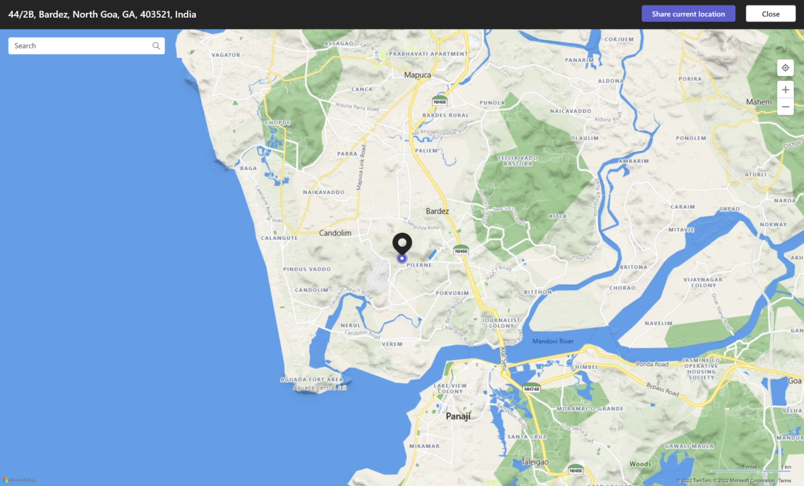

# Overview

 You can integrate the location capabilities within your Teams app. Use Microsoft Teams JavaScript client SDK, which provides well-defined APIs and the tools necessary for your app to access the user’s native device capabilities. Use the location APIs, such as `getLocation` and `showLocation` to integrate location capabilities within your app. At present, the web browsers, desktop apps, and mobile apps support the location capability.

## Advantages


The primary advantage of integrating location capabilities in your Teams apps is to leverage location functionality in web, desktop, and mobile app using Microsoft Teams JavaScript client SDK.

The following list provides the advantage of location capabilities:

* Share authentic health data of cellular towers with the management. The management can compare any mismatch between captured location information and the data submitted by maintenance staff.
* Locate technical support staff in a particular area. The app asks for permission to use the location to find support staffs near the specified area. After the permission is granted, the search results are filtered near that particular location and support staff IDs get displayed.
* Report the location after completing a job in the field.
* Track the attendance by using a selfie in the vicinity of the area. The location data also gets captured and sent along with the image. This scenario is specific for mobile apps.

To integrate location capabilities, you must do the following:

* Update the app manifest file and call the APIs.
* Have working knowledge of [code snippets](#code-snippets) for calling the location APIs.
* Handle errors in your Teams app with the help of [API response errors](#error-handling).

# [Mobile](#tab/mobile)

The following image depicts mobile app experience of location capabilities:

1. Open your Teams app.
1. Select **Media App**.
1. Select `getLocation` from the list.
1. Select **Allow** to access your location details.

  <!--  -->
  
  :::image type="content" source="~/assets/images/tabs/location-picker-mobile.png" alt-text="Illustration shows the location picker." border="true":::

# [Desktop or web](#tab/desktop)

The following image depicts desktop app experience of location capabilities:

1. Open your Teams app.
1. Select **Apps**  > **Manage your Apps** > **Publish an app** > **Upload a custom app**.
1. Select Media App .zip package.
1. Select **Add** to add app to your Teams.

  <!--  -->

  :::image type="content" source="~/assets/images/tabs/location-picker-desktop.png" alt-text="Location picker in desktop." border="true":::

The following image depicts web app experience of location capabilities:

  <!--  -->

  :::image type="content" source="~/assets/images/tabs/location-capability.png" alt-text="Illustration shows mobile location picker" border="true":::

---

## Update manifest

Update your Teams app [manifest.json](../../resources/schema/manifest-schema.md#devicepermissions) file by adding the `devicePermissions` property and specifying `geolocation`. It allows your app to ask for required permissions from users before they start using the location capabilities. The update for app manifest is as follows:

``` json
"devicePermissions": [
    "geolocation",
],
```

> [!NOTE]
> * The request permissions prompt is automatically displayed when a relevant Teams API is initiated. For more information, see [request device permissions](native-device-permissions.md).</br>
> * The device permissions are different in the browser. For more information, see [browser device permissions](browser-device-permissions.md).


## Location APIs

You must use the following set of APIs to enable your device's location capabilities:

| API      | Description |Input configuration `allowChooseLocation` |Input configuration `showMap` |
| --- | --- |--- |--- |
|`getLocation`|Provides user’s current device location or opens native location picker and returns the location chosen by the user. | * True: Users can choose any location of their choice.</br> * False: Users cannot change their current location. |False: The current location is fetched without displaying the map. [If `allowChooseLocation` is set to *true*, the `showMap` is ignored]. | 
|`showLocation`| Shows location on map. |* True: Users can choose any location of their choice.</br> * False: users cannot change their current location.| False: The current location is fetched without displaying the map. [If `allowChooseLocation` is set to *true*, the `showMap` is ignored]. | 

> [!NOTE]
> Desktop doesn't support capturing current location. However, after device permission is set, it captures the current location.


For more information on `getLocation` and `showLocation`, see [Location](/javascript/api/@microsoft/teams-js/microsoftteams.location?view=msteams-client-js-latest#getLocation_LocationProps___error__SdkError__location__Location_____void_&preserve-view=true).


## Error handling

You must ensure to handle these errors appropriately in your Teams app. The following table lists the error codes and the conditions under which the errors are generated:

|Error code |  Error name     | Condition|
| --------- | --------------- | -------- |
| **100** | NOT_SUPPORTED_ON_PLATFORM | API is not supported on the current platform.|
| **500** | INTERNAL_ERROR | Internal error is encountered while performing the required operation.|
| **1000** | PERMISSION_DENIED |User denied location permissions to the Teams App or the web-app .|
| **4000** | INVALID_ARGUMENTS | API is invoked with wrong or insufficient mandatory arguments.|
| **8000** | USER_ABORT |User cancelled the operation.|
| **9000** | OLD_PLATFORM | User is on old platform build where implementation of the API is not present. Upgrading the build should resolve the issue.|


### Code snippets

**Call `getLocation` API to retrieve the location:**

```javascript
let locationProps = {"allowChooseLocation":true,"showMap":true};
microsoftTeams.location.getLocation(locationProps, (err: microsoftTeams.SdkError, location: microsoftTeams.location.Location) => {
          if (err) {
            output(err);
            return;
          }
          output(JSON.stringify(location));
});
```

**Call `showLocation` API to display the location:**

```javascript
let location = {"latitude":17,"longitude":17};
microsoftTeams.location.showLocation(location, (err: microsoftTeams.SdkError, result: boolean) => {
          if (err) {
            output(err);
            return;
          }
     output(result);
});
```


### Code sample

|Sample name | Description | C# | Node.js |
|----------------|-----------------|--------------|--------------|
| App check-in current location | Users can check-in the current location and view all the previous location check-ins.| [View](https://github.com/OfficeDev/Microsoft-Teams-Samples/tree/main/samples/app-checkin-location/csharp) | [View](https://github.com/OfficeDev/Microsoft-Teams-Samples/tree/main/samples/app-checkin-location/nodejs) |


## See also

* [Integrate media capabilities in Teams](mobile-camera-image-permissions.md)
* [Integrate QR code or barcode scanner capability in Teams](qr-barcode-scanner-capability.md)
* [Integrate People Picker in Teams](people-picker-capability.md)
