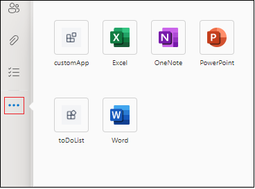

# Upgrade Teams Application to Work with Outlook and Office.com

Teams Toolkit offers helpers for Visual Studio Code developers to upgrade Teams applications (Tab application) to work with Outlook and Office. The feature helps upgrade the manifest and `TeamsJS` SDK to the latest version so that the application can run on Outlook and Office.com.

## Prerequisite

Install the latest version of Teams Toolkit from Visual Studio Code extension marketplace: [Teams Toolkit (Preview) - Visual Studio Marketplace](https://marketplace.visualstudio.com/items?itemName=TeamsDevApp.ms-teams-vscode-extension).

## Upgrade Manifest and SDK

In Visual Studio Code, open the command palette and find following commands:

* Teams: Upgrade Teams Manifest to Work in Outlook and Office
* Teams: Upgrade Teams Tab App to Work in Outlook and Office

### Upgrade Manifest

Run the command `Teams: Upgrade Teams Manifest to Work in Outlook and Office` and select your Teams Tab App manifest file to migrate:

1. Update manifest version to `m365DevPreview`.
1. Update manifest file to use the latest `DevPreview` schema.

### Upgrade Custom Tab

Run the command `Teams: Upgrade Teams Tab App to Work in Outlook and Office` and select your Teams Tab App project to migrate:

1. Update Teams JS SDK to the latest beta version.
1. Update function references, Enum and interface references.
1. Add `TODO` comments to finish changing callbacks to promises manually.

[!Note]
> changing from callbacks to promises alters control flow and cannot be fully automated. This code will have `TODO` comments for developers review. The typical solution is to make parent function `async` and use `await` next to each promise.

1. Add `TODO` in places where developers may be impacted by changes to the context schema.

[!Note]
> transforming JavaScript inline within HTML is not supported.

## Run  your Teams application in Outlook and Office.com

After upgrading your Teams application, you should be able to run them in Outlook and Office.com.

### Prerequisites

You can test your application in Outlook and Office.com by uploading your application through Teams client, following these steps:

1. Push your code changes to the server hosting your application.
1. Package your application (manifest and application icons) into a zip folder.
1. Go to Teams client and select **Apps**.
1. Select **Upload a custom app** and select your application package zip folder.
1. Select **Add** on app details overlay to install the application.

Teams will install and launch your app. You can find your app in **More added apps** flyout.

## Run Teams application in Outlook

You can preview your personal tab apps in both Outlook Web App and Outlook Desktop Clients following these steps:

### Outlook Web Application

1. Go to https://outlook.office.com 
1. Select the three dots on the bottom left bar.

1. Select the name of your app to preview it in Outlook Web Application.

## Outlook Desktop Client

1. Open your Outlook desktop client.
1. Select the three dots on the bottom left bar.
1. Select the name of your app to preview it in Outlook Desktop Client.

## Run Teams application in Office.com

You can preview your apps in Outlook web client following these steps:

1. Go to www.office.com/m365apps
1. Find you apps listed below “M365 Apps”

1. Click on the name of your app to preview it in office.com

## Create a custom Tab app with Teams Toolkit and Run it in Outlook and Office.com

You can try to create a new tab app using Teams Toolkit and run it in Outlook and Office.com! You can follow this steps:

1. Create a new Teams app in Visual Studio Code with Teams Toolkit, use command palette and run: `Teams: Create New Project` and select `Create a new Teams app` in the next step.

1. Select `Tab` in the next window and click `OK`.

1. Select `Azure` as hosting type.

1. Select an optional cloud resources, programming language of your choice, project location and a name of your project in the following project creation wizard.

The above step will create a new Teams application with Tab capability for your. Once the project has been successfully created:

1. Open command palette and run: `Teams: Upgrade Teams Manifest to Work in Outlook and Office`

1. Provision your app in the cloud

1. Deploy your app to cloud

1. Create a zip folder for your app package

Follow steps in `Run your Teams application in Outlook and Office.com` to run it in Outlook and Office.com.
You can also play around with the latest TeamsJS SDK (Link to new SDK updates), simply run the command: “Teams: Upgrade Teams Tab App to Work in Outlook and Office”, checking the `TODO`s left in your code and start using features in the latest SDK.